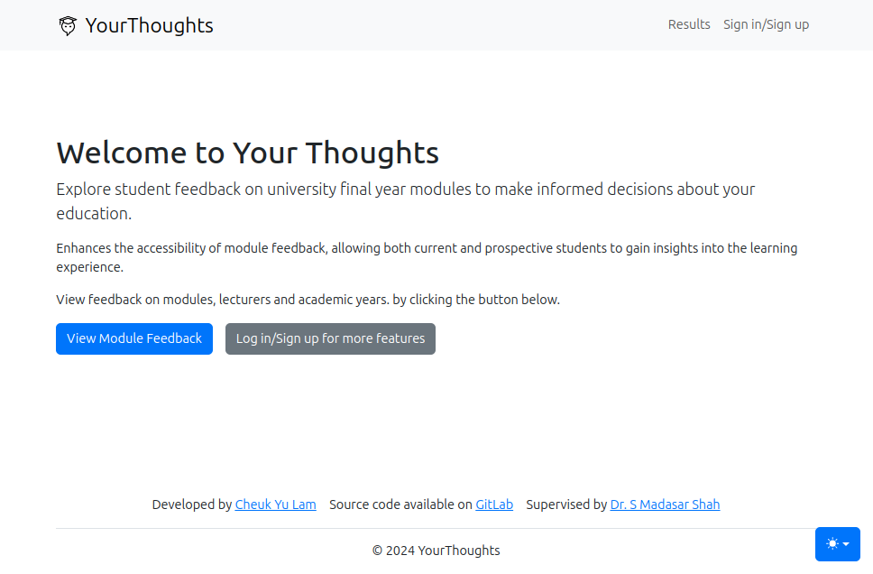

YourThoughts
----------------
YourThoughts is a platform that uses user-centred design and advanced software development to
improve educational feedback mechanisms. 

This system enhances transparency and accessibility in
module evaluations, offering open feedback outcomes.

Demonstration Link: https://yourthoughts.me/

Technologies Used
----------------
- Django (Python)
- React (JavaScript)
- Bootstrap (CSS)
- PostgreSQL and SQLite (Database)
- spaCy (Natural Language Processing)
- Docker (Containerization)
- GitHub Workflow (CI/CD)
- Orcale Cloud (Hosting)
- Nginx (Web Server)

Running the Project
----------------
1. Clone the repository
2. Install the required dependencies:
    - `pip install -r requirements.txt`
    - `npm install`
3. Make migrations and migrate the database:
    - `python manage.py makemigrations`
    - `python manage.py migrate`
4. Create a superuser:
    - `python manage.py createsuperuser`
5. Run the Django server: 
    - `python manage.py runserver`
6. Build the React frontend:
    - `npm run build`
7. Start the React server:
    - `npm start`
8. Visit `http://localhost:3000/` in the browser